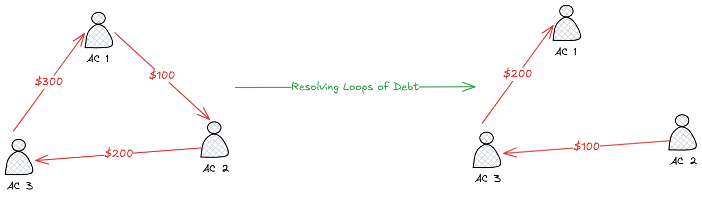

# Blockchain Splitwise

We want to create a decentralized system to track debit and credit - a blockchain version of Splitwise. If you haven’t heard of the app, it’s a simple way to keep track of who owes who money within a group of people (maybe after splitting lunch, groceries, or bills). To illustrate the application, consider the following scenario:

Alice, Bob and Carol are all friends who like to go out to eat together. Bob paid for lunch last time he and Alice went out to eat, so Alice owes Bob $10. Similarly, Carol paid when she and Bob went out to eat, and so Bob owes Carol $10.

Now, imagine Carol runs short on cash, and borrows $10 from Alice. Notice that at this point, instead of each person paying back their ‘loan’ at some point, they could just all agree that nobody owes anyone. In other words, whenever there is **a cycle of debt**, we can just **remove** it from our bookkeeping, making everything simpler and reducing the number of times cash needs to change hands.

We will build a decentralized way to track who owes what to who, so that no trusted third party has to be relied upon. It will be efficient: it won’t cost an exorbitant amount of gas to store this data. No value will get transferred ’on the blockchain’ using this app; the only ether involved will be for gas.

Because it’s on the blockchain, when Carol picks up the check for her and Bob’s meal, she can ask Bob to submit an IOU (which he can do using our DApp), and she can verify that he indeed has. The public on-chain storage will serve as a single source of truth for who owes who. Later, when the cycle illustrated above gets resolved, Carol will see that Bob no longer owes her money.

# Resolving Loops of Debt



Here is the demo of 

1. account 1 borrows $100 from account 2.
1. account 2 borrows $200 from account 3.
1. account 3 borrows $300 from account 1.

This shows the DApp can resolve the loop of debt.


# How to run

1. run local EVM

```bash
$ anvil
```

2. build and deploy the smart contract

```bash
forge create ./contracts/mycontract.sol:Splitwise \
    --rpc-url http://127.0.0.1:8545 \
    --broadcast \
    --private-key <private-key> \
```

3. open `index.html`
