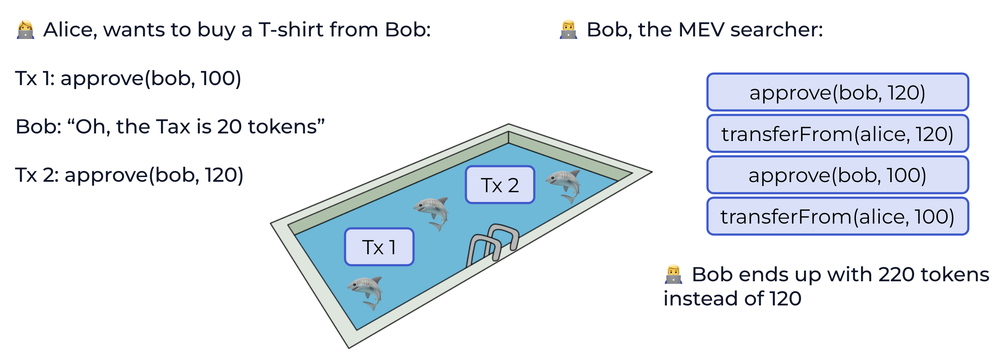

# Checkpoint 0: basic ownership and handling native currency

Implement a smart contract in [src/0-basic/BasicWallet.sol](src/0-basic/BasicWallet.sol) such that:

• it has an `owner() public view return(address)` method that returns the current owner
of the wallet
• the default value for owner is the address who deployed the contract
• it can receive ether from other addresses
• it can send ether to other addresses

## Questions

Q. what happens when call transferEth with an amount greater than the contract’s balance?

The following if condition will be satisfied when the amount to be transferred is greater than the contract's balance and the custom error `InsuffientBalance` will be triggered.

```
if (address(this).balance < amount) {
    revert InsuffientBalance();
}
```

Q. what happens when the recipient of a transfer does not exist?

The transfer will still succeed even if the recipient address does not exist. The ether will be sent to that address and will remain there until someone with access to the private key of that address decides to use it.

Q. what happens when the recipient of a transfer is a contract?

If a contract receives Ether (without a function being called), either the receive Ether or the fallback function is executed. If it does not have a receive nor a fallback function, the Ether will be rejected (by throwing an exception).

Ref: https://docs.soliditylang.org/en/v0.8.30/security-considerations.html#sending-and-receiving-ether

Q. why do we use msg.sender and not tx.origin to perform the authorization check?

* tx.origin: Refers to the original address that initiated the entire transaction. It remains the same throughout the call chain.
* msg.sender: Refers to the immediate caller of the current function. It changes with each contract hop (e.g., if Contract A calls Contract B, msg.sender in B is A's address).
* Using tx.origin for checks like require(tx.origin == owner, "Not authorized"); is insecure because it can be exploited in multi-contract scenarios. Malicious contracts can impersonate trusted users by relaying calls, bypassing your auth logic.
* Example attack: https://github.com/timyiu478/the-ethernaut/blob/main/levels/lv_4.md


Q. does owner have to be an EOA? if not, how?

* No. It can be any valid address, including a contract address.
* If we deploy the contract from another smart contract, the deploying contract's address becomes the owner.


Q. what happens if we lose access to the key that controls owner?

The amount of ether in the contract will remain inaccessible since only the owner can authorize transfers and if the key controlling the owner is lost, no one will be able to authorize transfers anymore.

Q. why do we transfer ether out of the contract with a low level call and not Solidity’s transfer?

Gas costs are subject to change, so smart contracts can’t depend on any particular gas costs. Any smart contract that uses transfer() or send() is taking a hard dependency on gas costs by forwarding a fixed amount of gas: 2300.

Ref: https://diligence.consensys.io/blog/2019/09/stop-using-soliditys-transfer-now/

Q. what happens if we send ERC-20 tokens (e.g. USDC) to our wallet address?

---

# Checkpoint 1: handling ERC-20 tokens

Implement a smart contract in [src/1-erc20/ERC20Wallet.sol](src/1-erc20/ERC20Wallet.sol) such that:

• it can receive ERC-20 tokens
• it can transfer tokens
• it can manage token approvals

## Questions

Q. what would happen if we didn’t handle token quirks properly?

* Quirks: token implementation does not fully comply with the ERC-20 standard
* Quirk 1: the `transfer` function returns `bool` indicating success, but some tokens do not return any value (e.g. USDT)
    * If we don’t handle these quirks properly, our contract may assume that a transfer failed when it actually succeeded, or vice versa. This can lead to incorrect logic in our contract (e.g. revert on a successful transfer)
* Quirk 2: approve race condition



Ref: https://andrej.hashnode.dev/integrating-arbitrary-erc-20-tokens

Q. how would we know about ERC-20 tokens owned by the wallet? (e.g. to display in a UI)

* The ERC-20 tokens have the `balanceOf` function we can call to get the balance of tokens owned by the wallet contract.
* We can maintain a list of known ERC-20 token addresses and query each of them for the wallet's balance.

Ref: https://eips.ethereum.org/EIPS/eip-20

Q. what about `decimals()`? does the wallet need to be concerned with these?

* Yes, if we want to perform arithmetic operations on token amounts, we need to be aware of the token's decimal places to ensure accurate calculations.
* Performing basic math operations with a lower number of decimals can result in precision loss, and with a higher number of decimals can result in potential overflows. One other canonical piece of advice is to always round against the User and in favor of the Protocol to reduce the risk of exploits.

---


# Checkpoint 2: basic multisig

Implement the following changes to [src/2-multisig/MultisigWallet.sol](src/2-multisig/MultisigWallet.sol):

• pass three admin addresses in the constructor instead of relying on the deployer
• implement an approve(bytes) function that admins can invoke to authorize an action encoded in bytes and emits an Approved(address admin, bytes action) event
• implement an execute(bytes) function that anyone can invoke (!) to execute the action encoded in bytes as long as it is approved by 2 or more admins, and also counts as an approval when invoked by an admin

Because execute(bytes) counts as an approval when invoked by an admin, the following two flows should be supported:

```
approve ( bytes ) // by admin1
approve ( bytes ) // by admin2
execute ( bytes ) // by anyone
```

or:

```
approve ( bytes ) // by admin1
execute ( bytes ) // by admin2
```

## Questions

Q. what is the point of emitting events in approve and execute?

* Once 2 approvals are detected by the watcher, it can trigger the execution of the action automatically.
* Once the execution is done, it can emit another event indicating the action has been executed.

---

# Checkpoint 3: integration with Aave

We will use mainnet fork testing. This means that in order to run the tests locally, you need to have an Ethereum mainnet RPC url (e.g. via Infura or Alchemy) and then invoke the tests with:

```
MAINNET_RPC_URL = < your - rpc - url > forge test -- mc Checkpoint3
```

The contract will also need use the real mainnet addresses of various tokens and Aave endpoints, see [src/3-aave/AaveAddresses.sol](src/3-aave/AaveAddresses.sol).

Implement the integration in src/3-aave/AaveSupplier.sol with the following low-level interface:

```
// deposit ERC20 tokens owned by this contract to Aave
function depositERC20 ( address asset , uint256 amount ) external ;
// withdraw ERC20 tokens from Aave , send them to the recipient
function withdrawERC20 ( address asset , uint256 amount , address recipient ) external ;
```

and the following higher-level interface:

```
// wraps the contract balance of ETH to WETH and deposits it to Aave
function depositEth () external payable ;

// withdraws the contract balance of WETH from Aave , unwraps it to ETH
// and sends it to the recipient
function withdrawEth ( address recipient ) external returns ( uint256 ) ;
```

## Implementation Tips

* We need to approve the Aave LendingPool contract to pull the tokens from our wallet before we can deposit them.
    * IERC20 interface is needed
* https://aave.com/docs/developers/smart-contracts/pool
